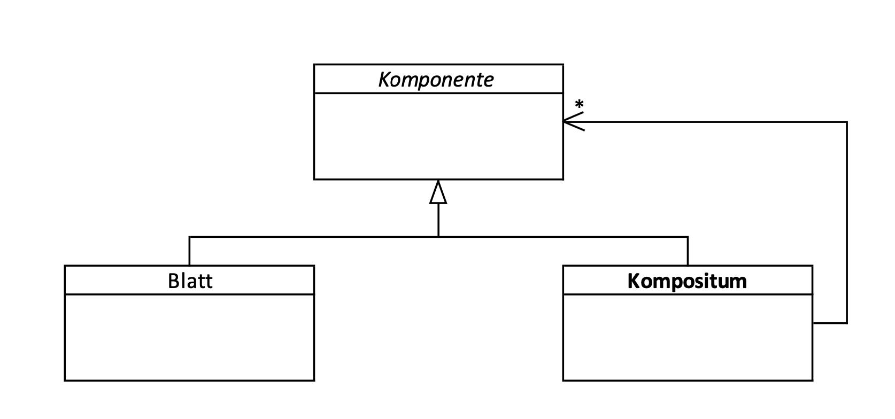
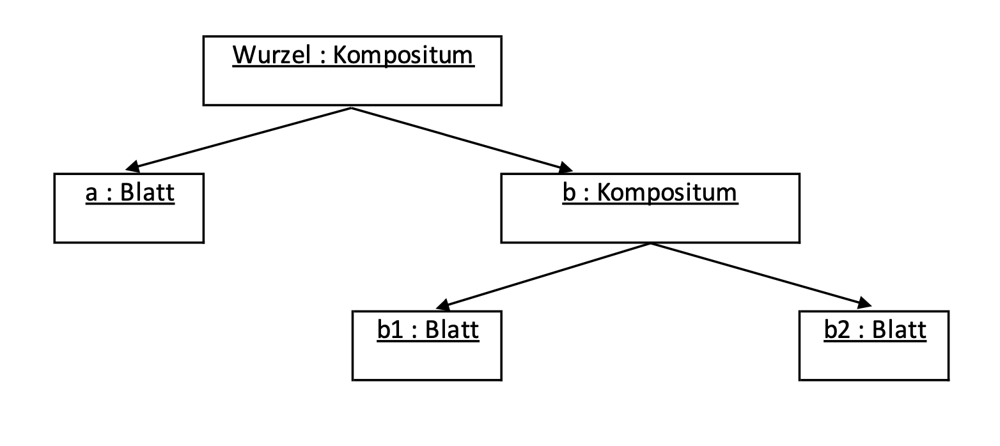

# Theorieaufgabe – Beschreibung eines Design Patterns: Composite

Ein Design Pattern oder Entwurfsmuster ist eine Art Vorlage oder „Schablone“ für die Lösung von bekannten Problemen im Software Design. Für unsere Beschreibung haben wir uns unter der Gruppe der Strukturmuster das **„Kompositum“** bzw. „Composite“ ausgesucht.

## 1. Allgemeines

Das Kompositum ist ein beliebtes und häufig genutztes Muster, da es eine Hierarchie von Teil-Ganzes-Beziehungen ideal abbilden kann, wie es etwa bei Dateiverwaltungssystemen, Sitemaps, Menüs oder sonstigen Baumstrukturen der Fall ist. Außerdem wird es verwendet, um Unterschiede zwischen einzelnen und zusammengesetzten Objekten zu verbergen. Besonders empfiehlt sich die Verwendung einer Composite-Struktur, wenn viele Objekte ähnlich verwendet werden.

## 2. Klassen und Bestandteile einer Composite-Struktur

Die Composite-Struktur besteht aus verschiedenen Bestandteilen:

### Komponente

Die Komponente dient als abstrakte Basisklasse bzw. als Interface und definiert, wie sich alle Bestandteile (also „Komponenten“ der Struktur) verhalten.

### Blatt

Einzelne nicht weiter unterteilte Objekte (besitzen keine Kindobjekte) werden durch ein Blatt repräsentiert.

### Kompositum

Ein Kompositum dient gewissermaßen als „Container“ für weitere Komponenten/Kindobjekte, also weitere Komposita oder Blätter.

## 3. Rollen und Beziehungen der Elemente zueinander

In einem Dateiverzeichnis würde eine Datei einem Blatt entsprechen, ein (Unter-)Ordner einem Kompositum. Wie bei einem Verzeichnis kann ein Unterordner/Kompositum sowohl einzelne Blätter/Dateien als auch weitere Unterordner/Komposita mit Blättern/Dateien enthalten, die Struktur ist unendlich fortführbar. Die Strukturierung der Unterordner erlaubt ein Delegieren von Informationen und Aufgaben an Objekte der jeweiligen Container – damit können Blätter und Container gleich behandelt werden, während die tatsächliche Umsetzung der Requests in Containern an die Kindobjekte darunter bis hin zu den Blätter weitergeleitet wird. So können alle Blätter adressiert werden.

## Quellen:

Gamma, E., Helm, R., Johnson, R. Vlissides, J. (2010): _Entwurfsmuster: Elemente wiederverwendbarer objektorientierter Software._ (6. Auflage) Addison-Wesley

_Composite_ ([https://refactoring.guru/design-patterns/composite](https://refactoring.guru/design-patterns/composite))

_Composite in Python_ ([https://refactoring.guru/design-patterns/composite/python/example](https://refactoring.guru/design-patterns/composite/python/example))