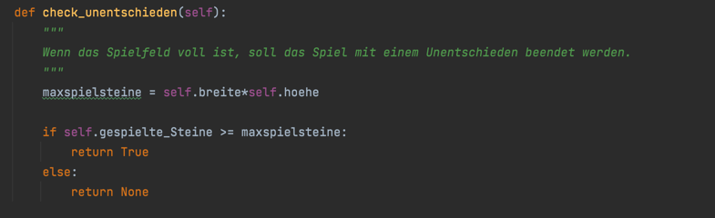

# Design

## Strukturierung

Im ersten Schritt haben wir anhand der Arbeitsangabe strukturiert, welche Funktionen unser Code erfüllen soll und was 
wir alles für deren Erfüllung benötigen. Die ersten Punkte waren daher das Design des Spielfelds, der Spielsteine und 
Spieler und des Spielablaufs. Für das Erstellen eines Spiels haben wir eine Klasse erstellt. 

Im Spielablauf wichtig war insbesondere das "Erkennen" von 4 gleichen Spielsteinen in einer Reihe, Spalte oder Diagonale.
Dazu wurden die Methoden get_spalte, get_reihe und get_diagonale erstellt, um diese 3 Strukturen darzustellen. 

## Durchführung von Spielzügen

Im nächsten Schritt haben wir das Durchführen eines Spielzugs entwickelt. Wichtig war dabei, dass einerseits der richtige 
Spielstein (X oder O) ausgewählt wird und andererseits, dass der Spielstein an die unterste freie Stelle in der Spalte 
rutschen muss. 

## Überprüfen auf Gewinn

Anschließend wurde die Funktion eingebaut, dass nach dem Durchführen des Spielzugs überprüft werden kann, ob es einen
Gewinn gibt – jeweils in einer Reihe, Spalte oder Diagonale. Wenn es keinen Gewinn gibt, soll das Spiel weiterlaufen.

## Start eines Spiels

Danach wurde das tatsächliche Starten eines Spiels designed. 
Dazu soll ein Spieler/eine Spielerin zum Input und damit zur Eingabe einer Zahl zwischen 1 und 7 aufgefordert werden – 
der "Indexzahl" für die Spalte, an deren Stelle er oder sie einen Spielstein einwirft. Das soll jedoch nur geschehen, 
wenn nicht zuvor bereits ein Gewinn ermittelt wurde. Deshalb wurde bereits im Anfang die Gewinnüberprüfung eingebaut,
damit anschließend in sich wiederholenden Schleifen durchgespielt werden kann. 

Wir haben uns dazu entschieden, dass der Versuch eines ungültigen Spielzugs zum Verlust der "Chance" führt und der 
Spielzug nicht wiederholt werden darf. Stattdessen ist der andere Spieler an der Reihe. 
Nach jedem Spielzug wird überprüft, ob es einen Gewinn gibt. Wurde ein Gewinn ermittelt, wird das Spiel beendet und 
die Person, die gewonnen hat, wird genannt.

## Computergegner
Nachdem der Code ausführlich überprüft wurde, haben wir noch die Möglichkeit eines Computergegners eingebaut. Hierzu 
war insbesondere wichtig, dass der Gegner zwar keine intelligenten, aber doch gültige Züge durchführen muss und dass es
zuvor ein Festlegen des Spielmodus (2 menschliche Spieler oder 1 Spieler gegen Computer) geben muss. 

## Unentschieden
Zum Schluss wurde noch die Beendigung des Spiels bei einem vollen Spielfeld ohne Gewinn definiert:

