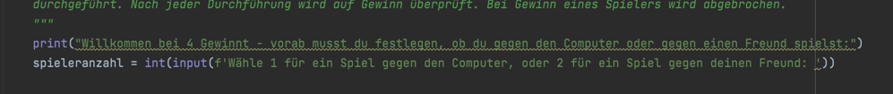

# Computergegner

Nachdem der Code ausführlich überprüft wurde, haben wir noch die Möglichkeit eines Computergegners eingebaut. Hierzu 
war insbesondere wichtig, dass der Gegner zwar keine intelligenten, aber doch gültige Züge durchführen muss und dass es
zuvor ein Festlegen des Spielmodus (2 menschliche Spieler oder 1 Spieler gegen Computer) geben muss. 

## Auswahl des Spielmodus:
Am Beginn des Spiels wird ein Spielmodus festgelegt. 

## xxx
Im Spiel wird definiert, dass 

