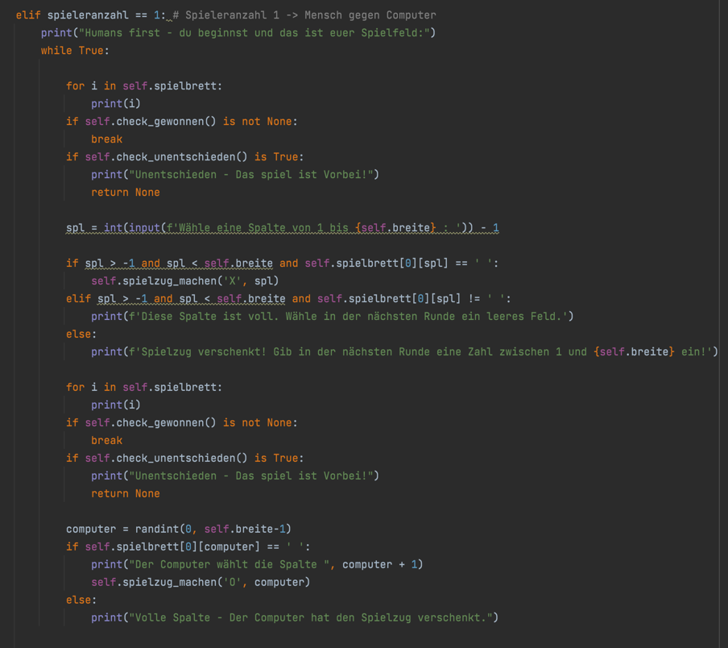

# Computergegner

Nachdem der Code ausführlich überprüft wurde, haben wir noch die Möglichkeit eines Computergegners eingebaut. Hierzu 
war insbesondere wichtig, dass der Gegner zwar keine intelligenten, aber doch gültige Züge durchführen muss und dass es
zuvor ein Festlegen des Spielmodus (2 menschliche Spieler oder 1 Spieler gegen Computer) geben muss. 

## Auswahl des Spielmodus

Am Beginn des Spiels wird ein Spielmodus festgelegt. 

## Spielzug Computer

Im Spiel wird definiert, dass der menschliche Spieler in der Mensch-gegen-Computer-Variante beginnt und der Computer anschließend einen Spielzug mit einer zufälligen Spaltenzahl zwischen 1 und 7 macht. 

Ein künstlich intelligenter Computergegner wurde nicht programmiert. 
